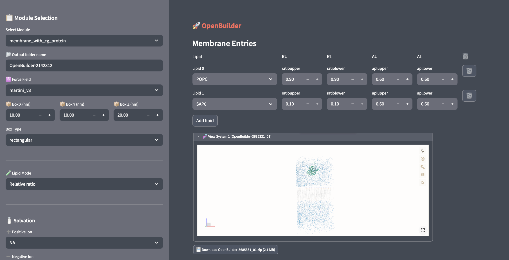

# OpenBuilder v0.1.0

OpenBuilder is a web-based tool for molecular modeling workflows built with **Python**, **MDAnalysis**, and **Streamlit**.  
It is designed to simplify structural preparation, analysis, and visualization tasks commonly encountered in computational structural biology and molecular simulations.



---

## Features

- Interactive **web interface** powered by Streamlit
- Integration with **MDAnalysis** for trajectory and structure handling
- Tools for molecular system preparation and analysis
- Lightweight environment setup using **Conda**
- Designed for reproducible computational workflows

---

## Installation

We recommend installing OpenBuilder using the provided **Conda environment**.

### 1. Create the environment

```bash
conda env create -f environment.yml
```

### 2. Activate the environment

```bash
conda activate openBuilder
```

---

## Running the Application

Once the environment is activated, launch the web application with:

```bash
streamlit run app.py
```

Your browser will automatically open the local web interface.

---

## Requirements

The environment installs the main dependencies automatically, including:

- Python 3.10
- COBY
- MDAnalysis
- NumPy
- Pandas
- SciPy
- Scikit-learn
- Streamlit

Additional packages are installed via pip where required.

---

## Contributing

Contributions, suggestions, and bug reports are welcome.  
Please open an issue or submit a pull request.

---

## License

This project is distributed under the MIT License.

---

## Acknowledgements

OpenBuilder builds upon several outstanding open-source projects in the computational molecular science ecosystem, including:

- **COBY**
- **MDAnalysis**
- **Streamlit**
- **NumPy / SciPy**
