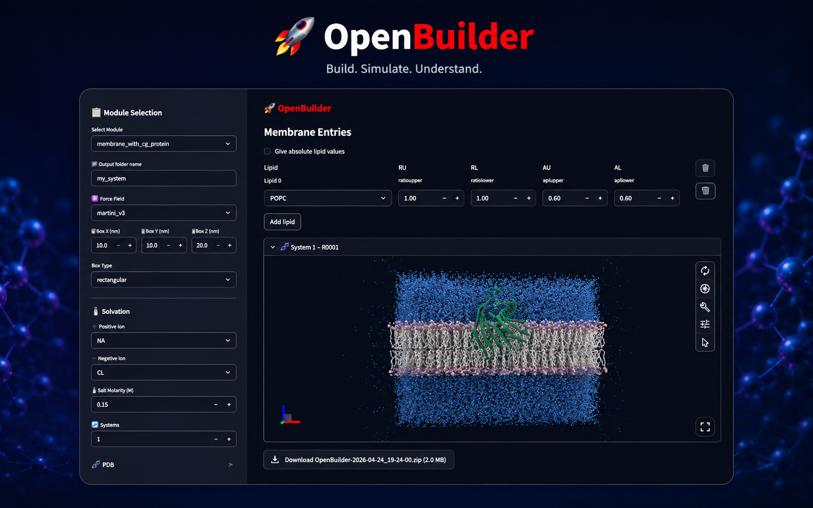

# OpenBuilder v1.0.2

OpenBuilder is a **web interface for COBY** designed specifically for building (and in the future analyzing) **MARTINI coarse-grained molecular simulations**.

Built with **Python**, **MDAnalysis**, and **Streamlit**, OpenBuilder aims to make simulation system preparation, analysis, and visualization more accessible through an intuitive web interface, without sacrificing reproducibility or local control.



---

## Features and Future Directions

- Interactive web interface powered by Streamlit  
- System preparation workflows built on COBY  
- Local-first execution model  
- Future hosted deployment at **open-builder.com**

---

## Installation

We recommend installing OpenBuilder using the provided Conda environment.

### Download repository
```bash
git clone https://github.com/lolicato/OpenBuilder.git
cd OpenBuilder
```

### Create the environment

```bash
conda env create -f environment.yml
```

### Activate the environment

```bash
conda activate OpenBuilder
```

---

## Running OpenBuilder

Launch the local web interface with:

```bash
streamlit run app.py
```

Your browser should automatically open the application.
On the first run and initial build, startup and execution may take longer as Python compiles source files into .pyc bytecode and caches dependencies, improving performance for subsequent runs.

---

## Requirements

Main dependencies include:

- Python 3.10  
- COBY  
- MDAnalysis  
- NumPy  
- Pandas  
- SciPy  
- Scikit-learn  
- Streamlit  

Additional packages may be installed through pip where required.

---

## Contributing

We welcome:

- Bug reports  
- Feature requests  
- Documentation improvements (creation) 
- Pull requests  
- New simulation workflows  

If you'd like to help shape OpenBuilder, feel free to open an issue or contact us directly.

---

## License

This software is currently available for academic and personal use only.

Modification, redistribution, forks, or derivative works are not permitted without prior written permission from the authors.

The project will be released under an open-source license after publication of the first associated research paper.

See the LICENSE file for full details.

---

## Acknowledgements

OpenBuilder builds on the work of incredible open-source communities:

- COBY  
- MDAnalysis  
- Streamlit  
- NumPy  
- SciPy  
